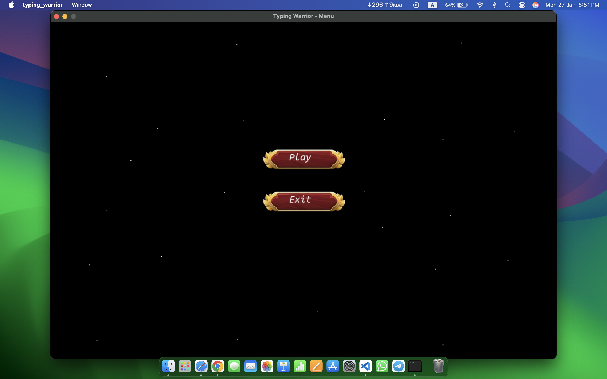
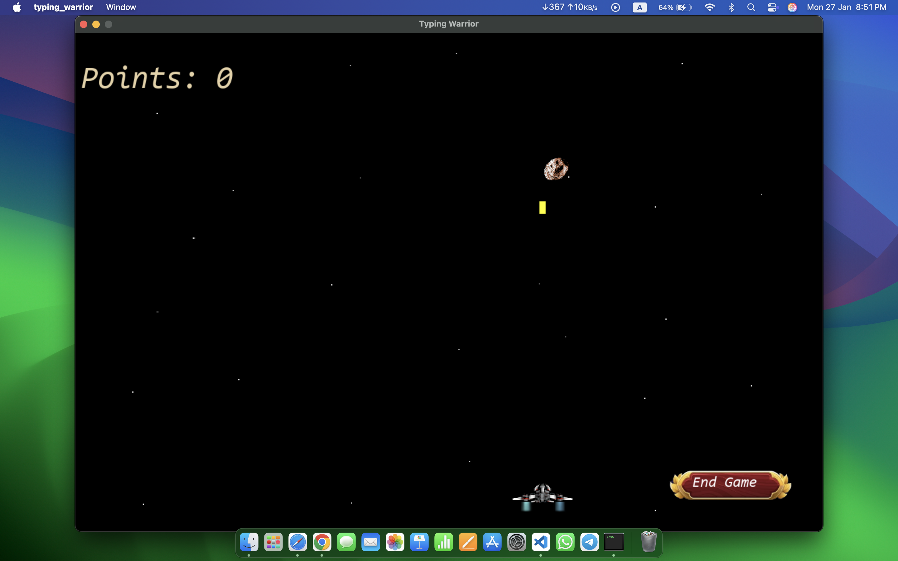
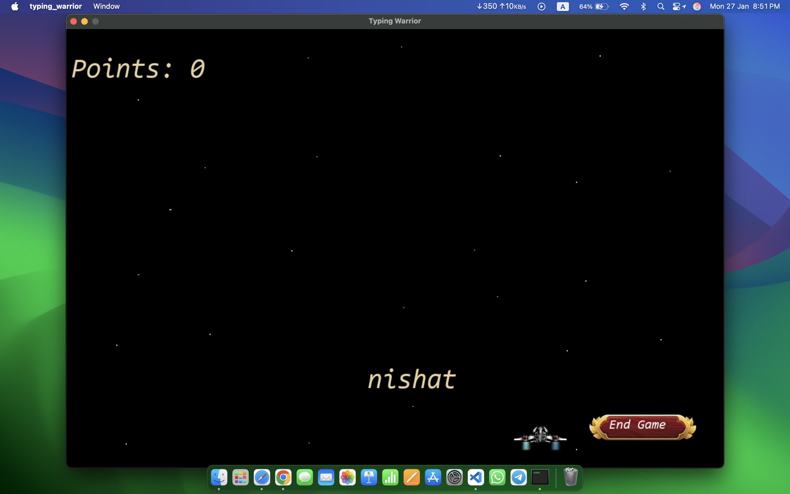
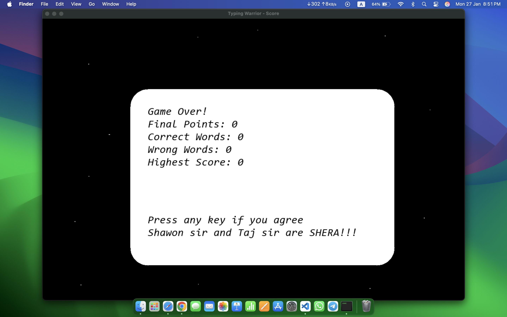

# Typing Warrior 🚀

A space-themed typing game where you defend against incoming asteroids by typing words correctly. Test your typing speed and accuracy while enjoying arcade-style gameplay!

## 🎮 Game Features

- Space shooter mechanics combined with typing practice
- Dynamic difficulty scaling based on score
- Score tracking with high score system
- Smooth spacecraft movement
- Word-based asteroid destruction
- Lives system
- Performance metrics (correct/wrong words)

## 🛠️ Prerequisites

To build and run Typing Warrior, you need:

- SDL2 library and its extensions:
  - SDL2_image
  - SDL2_ttf
  - SDL2_mixer
- C compiler (gcc recommended)
- Make (for building)

## 📁 Project Structure

```
typing-warrior/
├── src/
│   ├── main.c
│   ├── game.c
│   ├── menu.c
│   ├── score.c
│   ├── button.c
├── include/
│   ├── all_headers.h
│   ├── game.h
│   ├── menu.h
│   ├── score.h
│   └── button.h
├── img/
│   ├── asteroid.png
│   ├── _ship.png
│   ├── spexpb.bmp
│   ├── btn.png
│   └── btn_hover.png
└── others/
    ├── my_font.otf
    ├── words.txt
    └── highestScore.txt
```

## 🎯 Gameplay

1. **Main Menu**
   - Choose between Play and Exit options
   - Simple and intuitive interface

2. **Game**
   - Control your spacecraft with A/D or Left/Right arrow keys
   - Press SPACE to shoot at asteroids
   - Type the displayed words correctly to destroy asteroids
   - Each successful hit increases your score
   - Missing words or letting asteroids pass reduces lives
   - Game ends when you run out of lives

3. **Scoring System**
   - Points awarded based on word position when destroyed
   - Higher points for destroying asteroids quickly
   - Score penalties for incorrect words
   - High score system tracks your best performance

## 🚀 Controls

- **A/Left Arrow**: Move spacecraft left
- **D/Right Arrow**: Move spacecraft right
- **SPACE**: Shoot
- **Keyboard**: Type words to destroy asteroids
- **ESC**: Return to menu

## 🔧 Installation on MacBook

### Prerequisites

First, ensure you have the following installed on your MacBook:

1. **Xcode Command Line Tools**
   ```bash
   xcode-select --install
   ```

2. **Homebrew** (Package Manager)
   ```bash
   /bin/bash -c "$(curl -fsSL https://raw.githubusercontent.com/Homebrew/install/HEAD/install.sh)"
   ```

### Installing Dependencies

1. Install SDL2 and required libraries using Homebrew:
   ```bash
   brew install sdl2 sdl2_image sdl2_ttf sdl2_mixer
   ```
   
   Or use the provided make command:
   ```bash
   make install-deps
   ```

### Building the Game

1. Clone the repository:
   ```bash
   git clone [repository-url]
   cd typing-warrior
   ```

2. Build the game using make:
   ```bash
   make
   ```

### Running the Game

After successful compilation, run the game using:
```bash
./typing_warrior
```

### Troubleshooting

If you encounter any issues:

1. **SDL2 Header Files Not Found**
   - Verify SDL2 installation:
     ```bash
     brew list sdl2
     brew list sdl2_image
     brew list sdl2_ttf
     brew list sdl2_mixer
     ```
   - Try reinstalling the libraries:
     ```bash
     brew reinstall sdl2 sdl2_image sdl2_ttf sdl2_mixer
     ```

2. **Compilation Errors**
   - Make sure all dependencies are properly installed
   - Check if Xcode Command Line Tools are installed correctly
   - Try cleaning and rebuilding:
     ```bash
     make clean
     make
     ```

3. **Library Linking Issues**
   - Verify the library paths:
     ```bash
     brew --prefix sdl2
     ```
   - Make sure the paths in the Makefile match your system

### Directory Structure

```
typing-warrior/
├── src/               # Source files
├── include/           # Header files
├── img/              # Game images
└── others/           # Resources (font, word list)
```

### Cleaning Build Files

To remove the compiled executable:
```bash
make clean
```


## 🎨 Game Assets

The game requires the following assets to be present in their respective directories:
- Font file (`others/my_font.otf`)
- Word list (`others/words.txt`)
- Image assets in the `img/` directory
- High score file will be automatically created

## 📝 Contributing

Feel free to fork the repository and submit pull requests. For major changes, please open an issue first to discuss what you would like to change.

## 🎮 Game Screenshots

 
 

## 🙏 Acknowledgments

Special thanks to:
- Shawon sir and Taj sir
- SDL2 development team

Our Team:
- Efat Ara Belly     (2307004)
- MD. Farhan Israq   (2307012)
- Dibya Jyoti Roy    (2307022)
